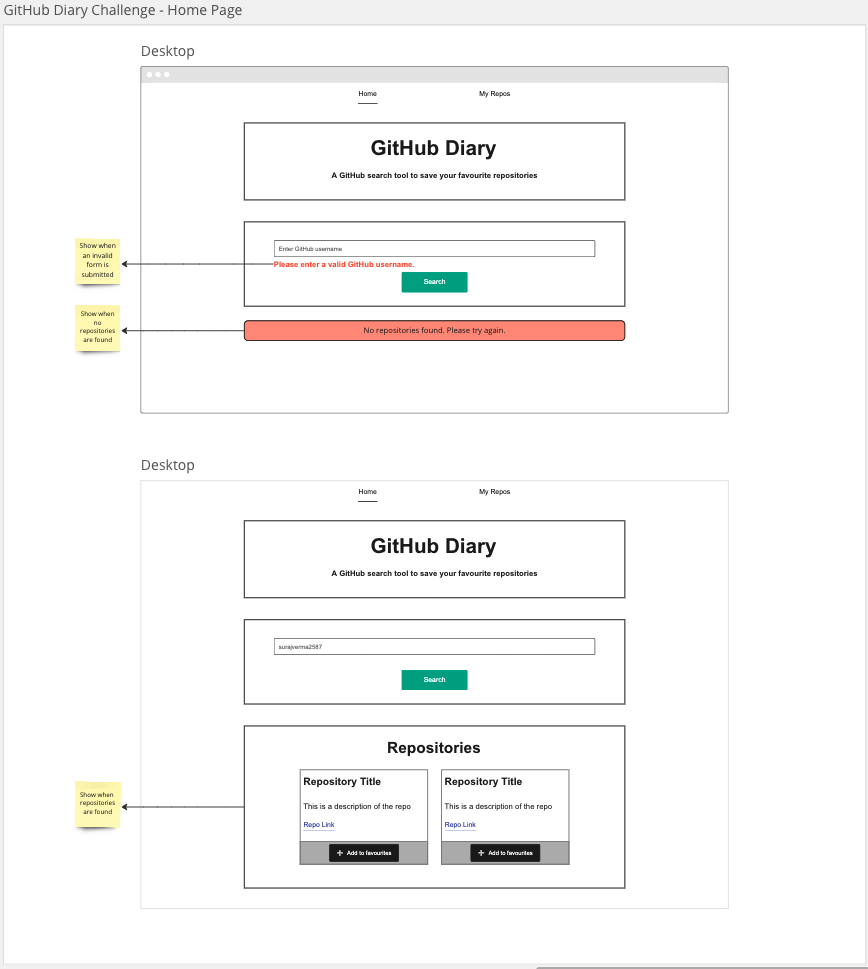
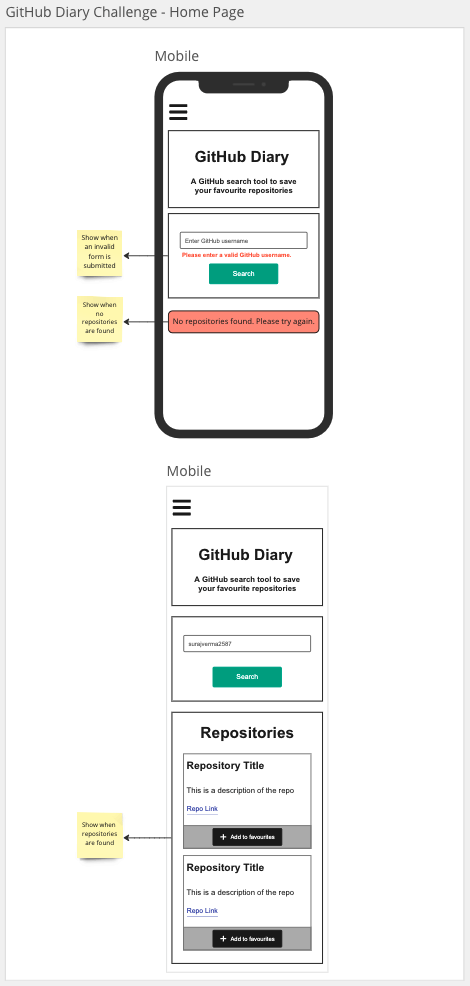
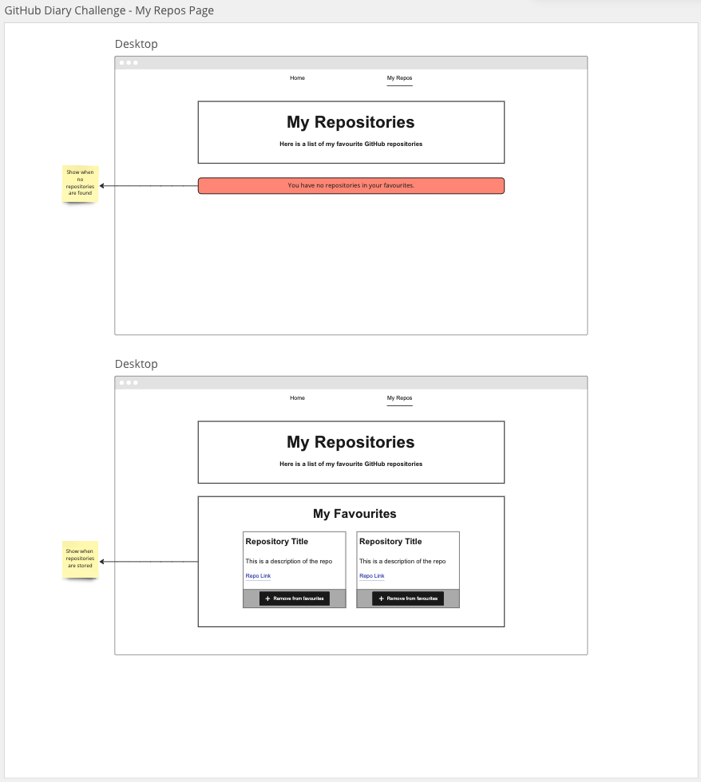
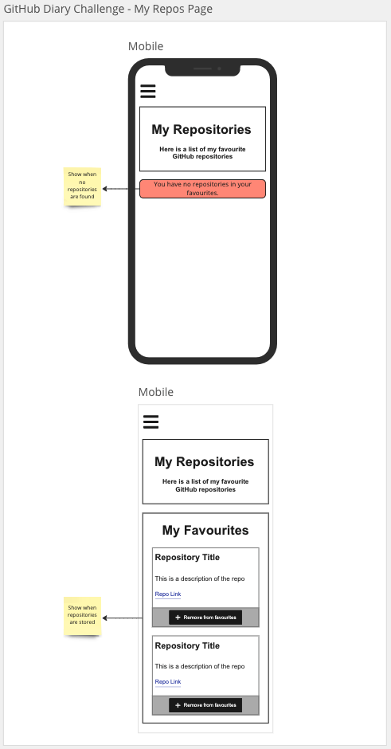

# GitHub Diary Application

## User Story

As a user I should be able save my favourite GitHub repositories

## Acceptance Criteria

- User should be able to search for repositories with a valid GitHub username `https://api.github.com/users/{username}/repos`
- Search form should have validation where github username is required else an error message should be displayed `"Please enter a valid username."`
- Repositories should be presented as many cards keeping in mind responsive layouts
- Each repository must be presented as a card with the following information:
  - Repo name
  - Repo url
  - Description
- If the number of repositories returned from the API is 0 then the user should be presented with an alert `"No repositories found."`
- Each repo card should contain a button `"Add to favourites"`
- When user clicks on "Add to favourites" button the repository information is stored in local storage
- User should be able to navigate using a nav bar
- When the user navigates to the favourites page if there are no favourites then the a message should be displayed `"You have no repositories stored in your favourites."`
- When the user clicks on the delete button in the favourites repository card that particular repository should be removed from local storage
- User must also be presented with a button to clear all favourites

## Pages

- Home page must contain a banner and a search form along with the list of repositories
- Favourites page must contain a list of repositories

## Design Guide






## Getting Started

1. > Navigate to your `coding_bootcamp` workspace:

```
cd ~/coding_bootcamp
```

2. > Create a react project using the `create-react-app` script and use your own app name:

```
npx create-react-app your-app-name
cd your-react-app
```

3. > Create a repository in [GitHub](https://github.com/new) and enter the "Repository name" as the same name as your react app.

4. > In the terminal within your react app enter the commands provided by GitHub. The first command points your local repository to the remote GitHub, the second command sets your branch as `main` and the last command pushes all your local changes to the remote repository

```
git remote add origin git@github.com:YOUR_GITHUB_USERNAME/your-app-name.git
git branch -M main
git push -u origin main
```

5. > Once you refresh your GitHub page on the web browser you will see all your local files in GitHub.

6. > You can now proceed to work locally and add commit and push code regularly during development

## Resources

- CSS framework: [Bootstrap 5](https://getbootstrap.com/docs/5.3/getting-started/introduction/)
- Colour palette: [coolors](https://coolors.co/)
- Icons: [font-awesome icons](https://fontawesome.com/icons) | [CDN](https://cdnjs.com/libraries/font-awesome)
- [React docs](https://beta.reactjs.org/)
